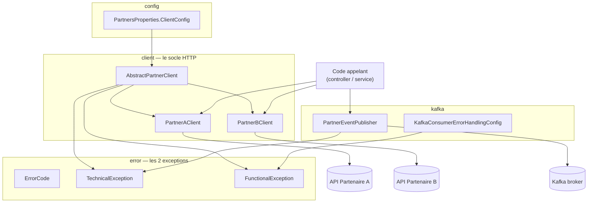
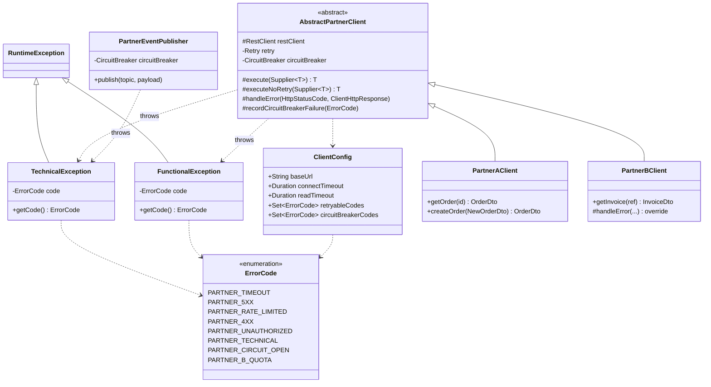
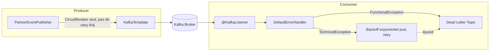

# Architecture — Socle technique d'appel partenaires

Ce document présente **l'architecture logicielle** de ce socle : le problème
qu'il résout, les décisions de conception et pourquoi, la structure du code,
et les principaux flux. Il est destiné à être lu une fois pour comprendre la
solution dans son ensemble, avant de plonger dans le code.

- Pour **utiliser** le socle au quotidien (config, dépannage, FAQ) → [README.md](README.md).
- Pour la **spec de référence** (signatures exactes, code source annoté) → [CLAUDE.md](CLAUDE.md).
- Diagrammes PlantUML détaillés (si vous préférez un outil PlantUML à Mermaid) →
  [socle-classes.puml](socle-classes.puml) et [socle-sequence.puml](socle-sequence.puml).

---

## Sommaire

1. [Le problème](#1-le-problème)
2. [Principes d'architecture](#2-principes-darchitecture)
3. [Vue d'ensemble des modules](#3-vue-densemble-des-modules)
4. [Diagramme de classes](#4-diagramme-de-classes)
5. [Diagramme de séquence — appel HTTP](#5-diagramme-de-séquence--appel-http)
6. [Vue Kafka](#6-vue-kafka)
7. [Décisions d'architecture (pourquoi ainsi)](#7-décisions-darchitecture-pourquoi-ainsi)

---

## 1. Le problème

L'application appelle plusieurs API partenaires. Pour chacune, deux
préoccupations bien distinctes se mélangent souvent dans le code si on n'y
prend pas garde :

- **La logique fonctionnelle** : quels endpoints, quel format de données —
  spécifique à chaque partenaire.
- **La mécanique technique** : timeouts, retry, circuit breaker, mapping des
  erreurs réseau/HTTP — **identique dans son principe** pour tous les
  partenaires, seuls les réglages (seuils, codes retryables...) changent.

Sans séparation, chaque nouveau client partenaire réimplémente sa propre
gestion d'erreur, avec des variations involontaires (l'un retry sur tout, un
autre sur rien, un troisième laisse fuiter une `RestClientException` jusqu'au
contrôleur...). Ce socle centralise la mécanique technique une seule fois, et
ne laisse aux classes partenaires que ce qui leur est propre.

## 2. Principes d'architecture

| Principe | Traduction dans le code |
|---|---|
| Séparer technique et fonctionnel | `AbstractPartnerClient` porte toute la mécanique ; les classes filles (`PartnerAClient`, `PartnerBClient`) n'écrivent que leurs endpoints. |
| Le mapping erreur → exception est écrit une seule fois | `handleError` dans `AbstractPartnerClient` ; jamais de `try/catch` sur une exception Spring dans un client fonctionnel. |
| Deux exceptions métier seulement | `TechnicalException` (panne, potentiellement retryable) et `FunctionalException` (refus métier, jamais retryable). |
| Générique + surcharge ponctuelle | `handleError` est une méthode template : un partenaire override, traite son cas, puis `super.handleError(...)`. |
| Les réglages appartiennent au partenaire | `retryable-codes` et `circuit-breaker-codes` sont dans la config de **chaque** partenaire, pas globaux. |
| Retry uniquement sur l'idempotent | `execute()` (retry+CB) vs `executeNoRetry()` (CB seul), au choix du client fonctionnel selon l'opération appelée. |

## 3. Vue d'ensemble des modules



Le code appelant (un contrôleur, un service métier) ne dépend jamais que des
classes `PartnerXClient` / `PartnerEventPublisher` — jamais directement de
Resilience4j, RestClient ou KafkaTemplate.

## 4. Diagramme de classes



Points à noter sur ce diagramme :
- `handleError` est une **méthode template** overridable (pas un hook à
  `Optional`) : `PartnerBClient` l'override, traite son code maison (422 +
  `QUOTA_EXCEEDED`) et son cas passthrough (404), puis appelle
  `super.handleError(...)` pour le reste.
- `PartnerEventPublisher` réutilise les mêmes deux exceptions mais n'a **pas**
  de `Retry` (le producer Kafka a ses propres retries natifs).

## 5. Diagramme de séquence — appel HTTP

```mermaid
sequenceDiagram
    actor Appelant
    participant Client as PartnerXClient
    participant Exec as execute()
    participant Retry
    participant CB as CircuitBreaker
    participant RC as RestClient
    participant Log as loggingInterceptor
    participant EH as handleError
    participant API as "Partenaire (API)"

    Appelant->>Client: getOrder(id)
    Client->>Exec: execute(supplier)
    Exec->>Retry: decorateSupplier
    Retry->>CB: decorateSupplier

    alt circuit OPEN
        CB-->>Exec: CallNotPermittedException
        Note right of Exec: -> TechnicalException(PARTNER_CIRCUIT_OPEN)<br/>aucun appel réseau
    else circuit CLOSED / HALF_OPEN
        CB->>RC: GET /orders/{id}
        RC->>Log: intercept(request)
        Log->>API: requête HTTP
        API-->>Log: réponse
        Log-->>RC: réponse (log INFO/WARN émis)
        alt statut d'erreur
            RC->>EH: handleError(status, response)
            EH-->>RC: throw Technical/FunctionalException (ou rien = passthrough)
            RC-->>CB: exception (ou résultat désérialisé si passthrough)
            CB->>CB: record si TechnicalException retenue
            CB-->>Retry: propage
            Retry->>Retry: retryable ? (Set&lt;ErrorCode&gt; du partenaire)
        else succès ou passthrough
            RC-->>CB: résultat désérialisé
            CB-->>Retry: résultat
        end
        Retry-->>Exec: résultat ou exception finale
    end
    Exec-->>Client: résultat ou exception métier
    Client-->>Appelant: OrderDto / exception
```

## 6. Vue Kafka



Détails et code : [CLAUDE.md — Kafka](CLAUDE.md#kafka-spring-kafka) et
[README.md — Kafka](README.md#6-kafka).

## 7. Décisions d'architecture (pourquoi ainsi)

| Décision | Pourquoi |
|---|---|
| Deux exceptions seulement (`Technical`/`Functional`), pas de flag `retryable` | La décision de retry dépend du **partenaire** (via `retryable-codes`), pas de l'exception elle-même — sinon on fige un choix qui devrait rester configurable. |
| `handleError` en méthode template overridable, pas un hook `Optional<RuntimeException>` | Un hook à `Optional` force à toujours produire une exception. Une vraie méthode template permet à un partenaire de ne **rien** lever (passthrough : la réponse est désérialisée normalement) — cas réel rencontré en cours de route. |
| `retryable-codes` et `circuit-breaker-codes` séparés | Un code peut être retryable sans compter pour le breaker (ex. 429 : on réessaie, mais ce n'est pas "le partenaire est en panne"). Les fusionner aurait empêché ce découplage. |
| `circuit-breaker-codes` optionnel, défaut = toute `TechnicalException` compte | Évite de devoir redéclarer une liste identique pour chaque partenaire ; un partenaire ne la déclare que s'il a un besoin spécifique (ex. mode passthrough). |
| `recordCircuitBreakerFailure(code)` | Nécessaire pour le cas où un partenaire est en passthrough total (ne lève plus rien) mais doit quand même faire réagir le breaker sur certains codes — pas possible avec le seul mécanisme d'exception. |
| `PARTNER_CIRCUIT_OPEN` distinct de `PARTNER_TECHNICAL` | Permet à l'appelant de détecter "le partenaire est connu en panne, pas même contacté" plutôt qu'une panne technique générique indifférenciée. |
| `executeNoRetry()` en plus de `execute()` | Le retry sur une opération non idempotente (POST) peut créer un doublon si le partenaire a bien reçu la 1ère requête malgré un timeout côté client. |
| Retry Resilience4j absent côté producer Kafka | Le producer Kafka a déjà ses propres retries de livraison (`retries`, `delivery.timeout.ms`) ; en empiler un deuxième multiplierait les tentatives inutilement. |
| Logs via un `ClientHttpRequestInterceptor`, métadonnées uniquement | Visibilité sur chaque tentative (y compris les retries) sans risque de fuite de données sensibles (le corps n'est jamais lu par le logger). |
