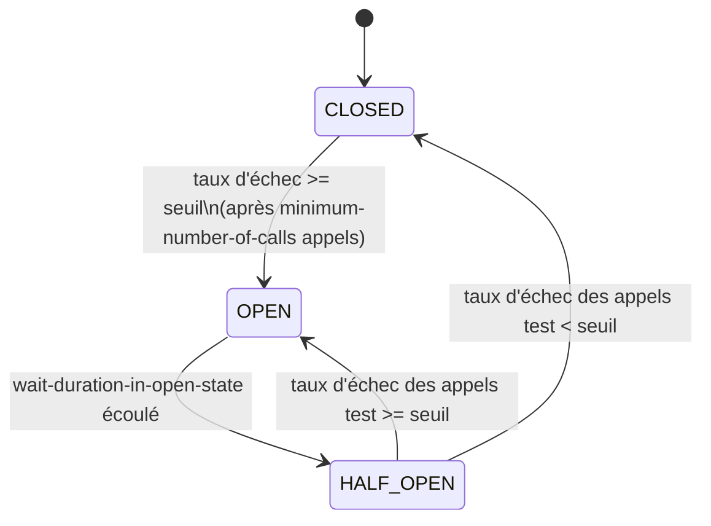

# Socle technique d'appel partenaires (HTTP + Kafka)

Ce document explique **comment fonctionne le socle** (retry, circuit breaker,
mapping d'erreurs, logs) et **comment l'utiliser** pour ajouter un partenaire.
Il est écrit pour être compréhensible par un développeur qui reprend le code
comme par quelqu'un côté fonctionnel qui veut comprendre pourquoi un appel
partenaire s'est comporté d'une certaine façon en prod.

Pour la vue d'ensemble de l'architecture (pourquoi ce découpage, diagrammes
UML, décisions de conception), voir [ARCHITECTURE.md](ARCHITECTURE.md).
Pour la spec technique détaillée (signatures exactes, code source de
référence), voir [CLAUDE.md](CLAUDE.md). Ce README est le guide d'usage
au quotidien ; ARCHITECTURE.md explique le "pourquoi", CLAUDE.md est la
référence technique.

---

## Sommaire

1. [En une phrase](#en-une-phrase)
2. [Les deux familles d'erreurs](#1-les-deux-familles-derreurs)
3. [Le Retry](#2-le-retry--on-réessaie-tout-seul)
4. [Le Circuit Breaker](#3-le-circuit-breaker--le-disjoncteur)
5. [Les logs](#4-les-logs)
6. [Ajouter un partenaire](#5-ajouter-un-partenaire)
7. [Kafka](#6-kafka)
8. [FAQ / pièges courants](#7-faq--pièges-courants)

---

## En une phrase

Quand on appelle une API partenaire, plein de choses peuvent mal tourner :
lenteur, panne temporaire, panne prolongée, erreur métier (partenaire qui
refuse la demande), etc. Ce socle centralise **une seule fois** trois
mécanismes de protection, pour que chaque client partenaire n'ait à écrire
que sa logique métier (ses endpoints, son mapping de données) :

- **Retry** : si l'appel échoue pour une raison passagère, on réessaie
  automatiquement quelques fois avant d'abandonner.
- **Circuit breaker** ("disjoncteur") : si un partenaire est en panne
  prolongée, on arrête de le solliciter pendant un moment au lieu de
  s'acharner (protège le partenaire ET notre propre application).
- **Mapping d'erreurs** : toute erreur (HTTP ou réseau) est traduite en une
  des deux exceptions métier du socle, jamais une exception Spring brute.

Ces trois mécanismes sont **indépendants et paramétrables par partenaire**,
car chaque partenaire a ses propres SLA et sa propre tolérance à la panne.

---

## 1. Les deux familles d'erreurs

Tout ce qui peut sortir d'un appel partenaire est réduit à deux exceptions,
chacune porteuse d'un `ErrorCode` (`PARTNER_TIMEOUT`, `PARTNER_5XX`,
`PARTNER_RATE_LIMITED`, `PARTNER_4XX`, `PARTNER_UNAUTHORIZED`,
`PARTNER_TECHNICAL`, `PARTNER_CIRCUIT_OPEN`, + codes maison comme
`PARTNER_B_QUOTA`) :

| | `TechnicalException` | `FunctionalException` |
|---|---|---|
| Sens | Panne technique (réseau, 5xx, rate limit...) | Erreur métier (le partenaire refuse la demande) |
| Peut être rejouée (retry) ? | Oui, si son code est dans la liste retryable du partenaire | **Jamais** |
| Compte pour le circuit breaker ? | Oui, si son code est dans la liste du partenaire (ou toujours, par défaut) | **Jamais** |

C'est cette distinction qui pilote tout le reste : le retry et le breaker ne
regardent jamais le code HTTP brut, seulement le couple (type d'exception,
`ErrorCode`).

---

## 2. Le Retry — "on réessaie tout seul"

**Analogie** : vous appelez quelqu'un, ça ne décroche pas tout de suite —
vous raccrochez et rappelez un peu plus tard, quelques fois, avant
d'abandonner et de laisser un message.

### Ce qui déclenche un retry

Un retry n'a lieu **que** si l'exception est une `TechnicalException` **et**
que son `ErrorCode` fait partie de `retryable-codes` pour ce partenaire :

```yaml
partners:
  clients:
    partnerA:
      retryable-codes: [PARTNER_TIMEOUT, PARTNER_5XX, PARTNER_RATE_LIMITED]
```

- Une `FunctionalException` n'est **jamais** rejouée, quel que soit le partenaire.
- Une `TechnicalException` dont le code n'est **pas** dans la liste n'est pas
  rejouée non plus (ex. un partenaire qui décide que ses 429 ne doivent pas
  être retentés).

### Les réglages (`resilience4j.retry`)

```yaml
resilience4j:
  retry:
    configs:
      default:
        max-attempts: 3                          # nombre total de tentatives (dont la 1ère)
        wait-duration: 500ms                      # délai avant la 2e tentative
        enable-exponential-backoff: true          # le délai augmente à chaque tentative
        exponential-backoff-multiplier: 2         # x2 à chaque fois : 500ms, 1s, 2s...
    instances:
      partnerA: { base-config: default }
      partnerB: { base-config: default, max-attempts: 5 }   # surcharge ponctuelle
```

| Clé | Effet |
|---|---|
| `max-attempts` | Nombre max de tentatives, 1ère incluse. `3` = 1 appel + 2 retries. |
| `wait-duration` | Délai avant la tentative suivante. |
| `enable-exponential-backoff` + `exponential-backoff-multiplier` | Le délai est multiplié à chaque tentative (évite de marteler un partenaire déjà en difficulté). |

### ⚠️ Retry et idempotence

Le retry ne doit s'appliquer qu'à des opérations **idempotentes** (GET,
consultation...). Pour un POST qui crée une ressource, rejouer l'appel après
un timeout pourrait créer un doublon (on ne sait pas si le partenaire a bien
reçu la 1ère requête). C'est pour ça que le socle expose deux méthodes :

- `execute(...)` → retry + circuit breaker. Pour les opérations idempotentes.
- `executeNoRetry(...)` → circuit breaker seul, jamais de retry. Pour un POST
  non idempotent, même si l'erreur obtenue a un code techniquement retryable.

---

## 3. Le Circuit Breaker — "le disjoncteur"

**Analogie** : un disjoncteur électrique. Si trop d'appareils tombent en
court-circuit d'affilée, le disjoncteur coupe le courant pour éviter de
cramer l'installation. Après un moment, on retente prudemment (un
appareil), et si ça repasse, on réarme tout. Ici, "le courant" c'est le
trafic vers un partenaire : si le partenaire est en panne, on arrête de le
solliciter (ça lui évite d'être encore plus submergé, et ça évite à notre
appli de perdre du temps sur des appels voués à échouer).

### Les 3 états



- **CLOSED** (fermé, normal) : tous les appels partent réellement vers le
  partenaire. Le breaker compte succès/échecs dans une fenêtre glissante.
- **OPEN** (ouvert) : plus aucun appel ne part vers le partenaire. Chaque
  tentative échoue **immédiatement** (sans toucher le réseau) avec une
  `TechnicalException(PARTNER_CIRCUIT_OPEN)`. Reste dans cet état pendant
  `wait-duration-in-open-state`.
- **HALF_OPEN** (semi-ouvert, transitoire) : après le délai, le breaker
  laisse passer un petit nombre d'appels "test" (`permitted-number-of-calls-in-half-open-state`).
  Si leur taux d'échec repasse sous le seuil → retour à CLOSED (le
  partenaire est guéri). Sinon → retour à OPEN (on retente plus tard).

### Détecter côté appelant que le breaker a rejeté l'appel

Quand le breaker est OPEN, resilience4j lève en interne une
`CallNotPermittedException` (avant même de toucher le réseau). Le socle
l'attrape dans `runProtected` et la retransforme en :

```java
throw new TechnicalException(ErrorCode.PARTNER_CIRCUIT_OPEN, "circuit breaker ouvert", e);
```

`PARTNER_CIRCUIT_OPEN` est un code **dédié**, distinct des autres codes
techniques (`PARTNER_5XX`, `PARTNER_TIMEOUT`...) : un appelant qui inspecte
`((TechnicalException) e).getCode()` peut donc savoir précisément "le
partenaire est connu en panne, on ne l'a même pas contacté" et réagir en
conséquence (message dédié, ne pas re-tenter côté appelant lui-même, etc.),
plutôt que de recevoir un code technique générique indifférenciable d'une
autre panne. Ce code n'est jamais dans `retryable-codes` d'un partenaire :
il est créé après que le retry a déjà renoncé (le breaker a rejeté l'appel
avant que quoi que ce soit ne parte), le mettre dans la liste n'aurait donc
aucun effet.

### Comment le taux d'échec est calculé

- **Fenêtre glissante** (`sliding-window-size`) : le breaker ne regarde que
  les N derniers appels (pas tout l'historique). Deux modes possibles
  (`sliding-window-type`, non fixé ici donc `COUNT_BASED` par défaut) :
  - `COUNT_BASED` (défaut) : les N derniers *appels*, quel que soit le temps
    que ça a pris.
  - `TIME_BASED` : les appels des N dernières *secondes*.
- **`minimum-number-of-calls`** : nombre minimum d'appels dans la fenêtre
  avant même de calculer un taux (évite d'ouvrir le breaker sur 2 échecs si
  la fenêtre fait 10 — pas assez de signal).
- **`failure-rate-threshold`** : pourcentage d'échecs au-delà duquel ça passe
  OPEN (ex. `50` = 50%).
- *(non utilisé dans ce socle, mais existe côté Resilience4j)* :
  `slow-call-rate-threshold` + `slow-call-duration-threshold` — permet
  d'ouvrir le breaker aussi sur des appels **lents** (pas juste en échec),
  ex. "si plus de 50% des appels dépassent 2 secondes, considère ça comme un
  échec". Utile si un partenaire ne tombe jamais en erreur mais devient
  inutilisable en lenteur.

```yaml
resilience4j:
  circuitbreaker:
    configs:
      default:
        sliding-window-size: 10
        minimum-number-of-calls: 5
        failure-rate-threshold: 50
        wait-duration-in-open-state: 10s
        permitted-number-of-calls-in-half-open-state: 3
        automatic-transition-from-open-to-half-open-enabled: true
    instances:
      partnerA: { base-config: default }
      partnerB: { base-config: default }
```

`automatic-transition-from-open-to-half-open-enabled: true` veut dire que le
passage OPEN → HALF_OPEN se fait tout seul après le délai (sinon il faudrait
qu'un appel arrive pour déclencher la vérification — avec `true`, un thread
interne s'en charge même sans trafic).

### Qu'est-ce qui compte comme un échec pour CE partenaire ?

Contrairement au retry (piloté uniquement en yaml via `retryable-codes`), ce
qui compte comme échec pour le breaker est un **predicate Java**, construit
dans `AbstractPartnerClient` à partir de `circuit-breaker-codes` (optionnel,
propre à chaque partenaire) :

```yaml
partners:
  clients:
    partnerB:
      # Optionnel : si absent, TOUTE TechnicalException compte comme échec (défaut).
      # Ne le renseigner que si un partenaire doit restreindre la liste.
      circuit-breaker-codes: [PARTNER_5XX, PARTNER_B_QUOTA]
```

- **Rien renseigné (cas par défaut, recommandé pour la plupart des partenaires)** :
  toute `TechnicalException`, quel que soit son code, compte comme un échec.
  Pas besoin de redéclarer une liste pour chaque partenaire.
- **Liste renseignée** : seuls les `ErrorCode` de la liste comptent comme
  échec. Une `TechnicalException` avec un code **hors liste** n'est pas
  ignorée à proprement parler : Resilience4j la traite comme un **succès**
  côté breaker (c'est le comportement standard du predicate `recordException`
  quand il renvoie `false` — l'appel a bien eu lieu, ce n'est juste pas un
  signal de panne pour ce partenaire).

Cette liste est **indépendante** de `retryable-codes` : un code peut être
retryable sans compter pour le breaker, et inversement. Exemple : un
partenaire pour qui les 429 (rate limit) doivent être retentés mais ne
doivent jamais faire ouvrir le breaker (ce n'est pas "le partenaire est en
panne", juste "on va trop vite").

### Cas particulier : passthrough + breaker quand même informé

Un client peut vouloir **tout renvoyer tel quel à l'appelant** (voir
[§7 FAQ](#je-veux-tout-renvoyer-la-réponse-telle-quelle-passthrough)),
c'est-à-dire que `handleError` ne lève plus jamais d'exception pour un
statut HTTP. Dans ce cas, `circuit-breaker-codes` ne sert à rien : il n'y a
plus aucune exception à filtrer, puisqu'il n'y en a plus du tout.

Si ce partenaire doit quand même faire ouvrir le breaker sur certains codes
techniques (ex. ses 5xx), il faut le signaler **manuellement**, sans lever
d'exception, via `recordCircuitBreakerFailure` :

```java
@Override
protected void handleError(HttpStatusCode status, ClientHttpResponse response) throws IOException {
    if (status.is5xxServerError()) {
        recordCircuitBreakerFailure(ErrorCode.PARTNER_5XX); // compte pour le breaker...
    }
    // ... mais on ne lève jamais rien : le corps repart tel quel vers l'appelant.
}
```

`recordCircuitBreakerFailure` respecte aussi `circuit-breaker-codes` : si le
code passé n'est pas dans la liste configurée pour ce partenaire, l'appel
n'a aucun effet (traité comme un succès, même logique que ci-dessus).

### Observer l'état des breakers en prod (Actuator)

Resilience4j s'intègre nativement avec Spring Boot Actuator : ajouter la
dépendance et quelques propriétés suffit, sans écrire de code.

```xml
<dependency>
    <groupId>org.springframework.boot</groupId>
    <artifactId>spring-boot-starter-actuator</artifactId>
</dependency>
```

```yaml
management:
  endpoints:
    web:
      exposure:
        include: health, circuitbreakers, circuitbreakerevents
  health:
    circuitbreakers:
      enabled: true
```

Endpoints alors disponibles :

| Endpoint | Contenu |
|---|---|
| `GET /actuator/health` | Le health check global inclut une section par breaker (état déduit de CLOSED/OPEN). |
| `GET /actuator/circuitbreakers` | Liste tous les breakers déclarés (`partnerA-managed`, `partnerB-managed`, `kafka-producer-managed`...) avec leur état courant et leurs métriques instantanées (taux d'échec, nombre d'appels bufferisés dans la fenêtre...). |
| `GET /actuator/circuitbreakerevents` | Historique des événements (transitions d'état, succès, échecs, appels rejetés). Filtrable par breaker : `/actuator/circuitbreakerevents/partnerA-managed`, et par type d'événement : `/actuator/circuitbreakerevents/partnerA-managed/STATE_TRANSITION`. |

C'est exactement le "breaker activé pour le partenaire A" recherché, sans
code custom. Si un Micrometer registry est présent (Prometheus, etc.),
Resilience4j publie aussi ces états en métriques (`resilience4j.circuitbreaker.state`,
`resilience4j.circuitbreaker.calls`...) — c'est la voie recommandée pour un
suivi dans la durée (dashboard + alerte), plutôt que d'interroger
`/actuator/circuitbreakers` à la main.

⚠️ Ces endpoints révèlent des détails opérationnels internes (quel
partenaire est en panne, à quelle fréquence). Ne pas les exposer tels quels
sur un port public sans authentification — restreindre `management.server.port`
et/ou la sécurité Spring Security dessus comme pour tout endpoint Actuator sensible.

---

## 4. Les logs

Chaque appel HTTP sortant est loggé automatiquement, **y compris à chaque
tentative de retry** (un intercepteur est posé sur le `RestClient`, donc
avant même que le retry ne décide de rejouer) :

```
INFO  c.e.p.client.AbstractPartnerClient.partnerA - GET https://api.partner-a.com/orders/42 -> 200 (87 ms)
WARN  c.e.p.client.AbstractPartnerClient.partnerB - GET https://api.partner-b.com/invoices/REF-1 -> échec réseau (301 ms) : Read timed out
```

- Un logger **par partenaire** (`AbstractPartnerClient.<nomPartenaire>`) :
  on peut monter/descendre le niveau de log d'un seul partenaire en prod
  sans toucher aux autres (`logging.level.com.example.partners.client.AbstractPartnerClient.partnerB=DEBUG`).
- Contenu : méthode, URI, statut, durée. **Jamais le corps** de la requête ou
  de la réponse (pas de buffering, pas de risque de fuite de données
  sensibles/PII dans les logs).
- INFO quand une réponse est reçue (quel que soit son statut — même un 500
  ou un 404 est "une réponse reçue", le WARN/ERROR viendra plus tard si
  besoin, au niveau applicatif). WARN si c'est un échec réseau (pas de
  réponse du tout).

---

## 5. Ajouter un partenaire

1. Un bloc dans `partners.clients.<nom>` : `base-url`, timeouts,
   `retryable-codes`, et `circuit-breaker-codes` si besoin (sinon, le défaut
   s'applique).
2. Deux instances Resilience4j (`retry` + `circuitbreaker`) avec
   `base-config: default`, à surcharger ponctuellement si besoin.
3. Une classe `@Component extends AbstractPartnerClient`. Override
   `handleError` seulement si le partenaire a un code maison ou un besoin de
   passthrough (traiter le cas, puis `super.handleError(...)` pour le
   reste — voir les exemples dans [PartnerBClient](src/main/java/com/example/partners/client/partnerb/PartnerBClient.java)).

---

## 6. Kafka

La classification d'erreurs (`TechnicalException`/`FunctionalException` +
`ErrorCode`) est réutilisée, mais le mécanisme diffère du HTTP :

- **Producer** (`PartnerEventPublisher`) : circuit breaker seul, **pas de
  retry Resilience4j**. Le producer Kafka a déjà ses propres retries de
  livraison (`retries`, `delivery.timeout.ms`, `acks`) — en ajouter un
  deuxième par-dessus multiplierait les tentatives inutilement. Le breaker
  sert uniquement à couper quand le broker est durablement injoignable.
- **Consumer** (`KafkaConsumerErrorHandlingConfig`) : un `@KafkaListener`
  n'est pas un appel qu'on déclenche, Spring pousse les messages —
  `execute()` ne s'applique pas. On utilise `DefaultErrorHandler` +
  backoff exponentiel + DLT (Dead Letter Topic). La distinction
  Technical/Functional passe par `addNotRetryableExceptions(FunctionalException.class)` :
  une erreur métier part directement en DLT, une erreur technique est
  rejouée selon le backoff avant de partir en DLT si elle persiste.

Détails complets : [CLAUDE.md](CLAUDE.md#kafka-spring-kafka).

---

## 7. FAQ / pièges courants

#### "Mon retry ne se déclenche pas, pourtant c'est une erreur 500"
Vérifiez que `PARTNER_5XX` est bien dans `retryable-codes` pour **ce**
partenaire. Chaque partenaire a sa propre liste, il n'y a pas de valeur
globale.

#### "Le circuit breaker ne s'ouvre jamais alors que le partenaire renvoie plein de 500"
Deux causes possibles :
1. `circuit-breaker-codes` est renseigné pour ce partenaire mais
   `PARTNER_5XX` n'y est pas → ces échecs sont traités comme des succès
   côté breaker (comportement voulu si c'est intentionnel).
2. Le client override `handleError` en mode passthrough (ne lève plus rien
   pour les erreurs HTTP) → plus aucune `TechnicalException` n'est créée
   depuis un statut HTTP. Solution : appeler `recordCircuitBreakerFailure(...)`
   explicitement pour les codes à surveiller (voir §3).

#### Je veux tout renvoyer la réponse telle quelle (passthrough)
Override `handleError` et ne levez rien (ni exception, ni appel à
`super.handleError(...)`) pour les statuts concernés : la réponse est alors
traitée comme un succès, `retrieve().body(...)` désérialise le corps
normalement, quel que soit le statut HTTP (4xx compris 5xx). Les erreurs
réseau (timeout, connexion refusée) ne passent pas par `handleError` — elles
restent mappées en `TechnicalException(PARTNER_TIMEOUT)` par ailleurs.

```java
@Override
protected void handleError(HttpStatusCode status, ClientHttpResponse response) throws IOException {
    // rien : quel que soit le status HTTP, on ne lève jamais rien.
}
```

#### "J'ai un POST qui doit créer une ressource, dois-je utiliser execute() ?"
Non — utilisez `executeNoRetry()`. Un retry sur un POST non idempotent après
un timeout pourrait créer un doublon côté partenaire (on ne sait pas s'il a
reçu la 1ère requête). `executeNoRetry()` garde le circuit breaker mais
désactive tout retry, quel que soit le code d'erreur.

#### "Je veux qu'un partenaire retry un code mais que ça ne compte pas pour le breaker"
C'est déjà le cas par défaut si vous configurez `circuit-breaker-codes` sans
y inclure ce code (ex. les 429 : on retry, mais ce n'est pas "le partenaire
est en panne", donc pas de raison d'ouvrir le breaker dessus).
